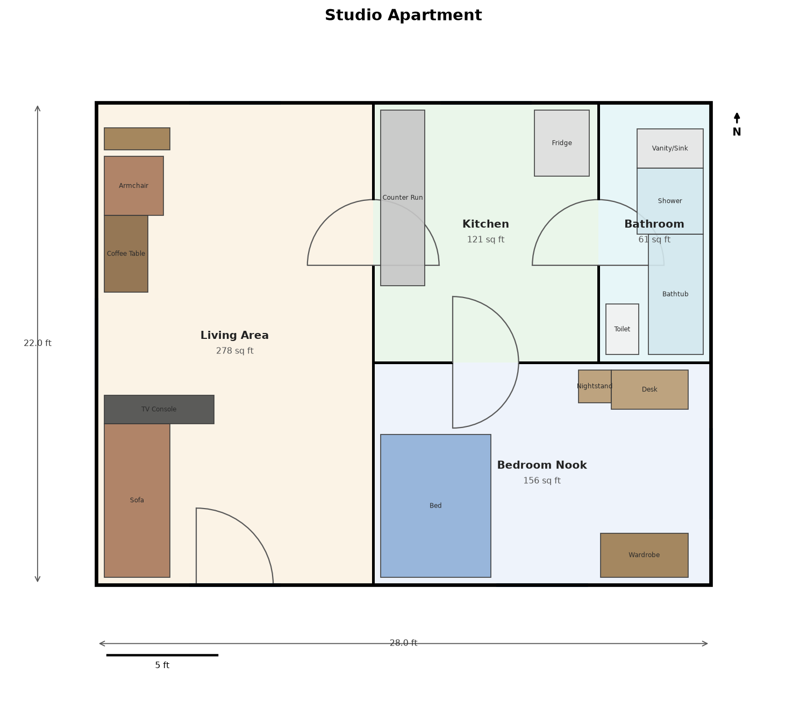
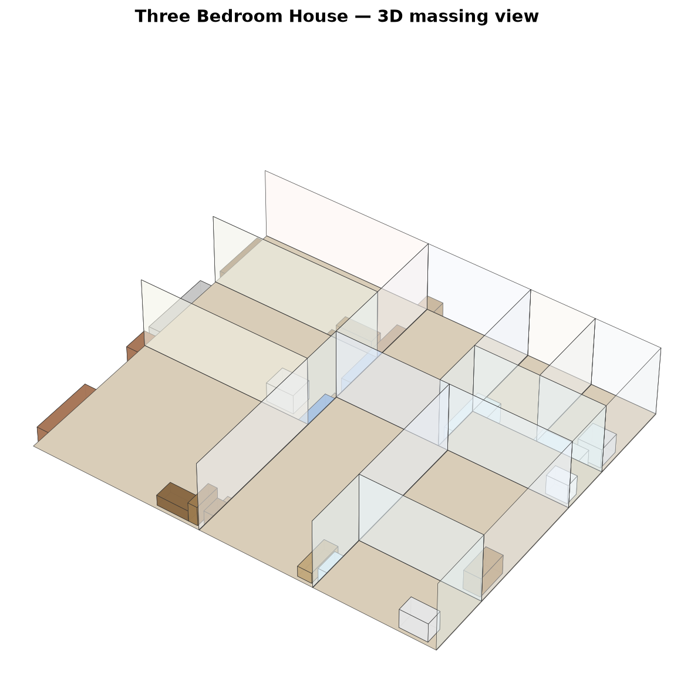

# Capstone — Architectural Interior Design Visuals & Layout Generator

A Python toolkit that turns a simple JSON room list into a complete
architectural floor-plan package: a non-overlapping room layout, placed
furniture, a labeled 2D floor plan (with doors, windows, dimensions, north
arrow and scale bar), and a pseudo-3D isometric "doll-house" view.

| Studio apartment floor plan | Three-bedroom house floor plan | 3D massing view |
|---|---|---|
|  |  |  |

## What it does

Given a building footprint and a list of rooms (name, type, and a relative
size weight), the pipeline:

1. **Lays out the floor plan** (`architectural_design/layout.py`) — a
   recursive space-partitioning ("guillotine slicing") algorithm divides the
   building envelope into non-overlapping rectangular rooms sized
   proportionally to each room's requested weight, always cutting
   perpendicular to the rectangle's longer side so rooms stay close to
   square rather than long slivers.
2. **Adds circulation** — wall adjacency between rooms is computed from
   shared edges, and a minimum-spanning tree over that adjacency graph
   decides where interior doors go, so every room is reachable. Private
   rooms (bedrooms, bathrooms, offices, closets, laundry) are capped at one
   door where the room graph allows it, so they read as private rooms
   rather than hallways; the cap is relaxed automatically wherever it's the
   only way to keep the whole plan connected. An exterior entry door is
   placed on the building's front wall, preferring an entry/hallway/living
   room over a bedroom or bathroom if one touches that wall. Any room
   touching an exterior wall gets a window.
3. **Furnishes each room** (`architectural_design/furniture_placer.py`) — a
   per-room-type furniture catalog (`furniture_catalog.py`) is placed
   against the walls in priority order (largest/most important piece
   first), skipping door swing clearances and windows, and never
   overlapping a previously placed piece. Items that don't fit are skipped
   and reported rather than forced to overlap.
4. **Renders the visuals**:
   - `renderer.py` — a 2D architectural floor plan via matplotlib: walls
     with door/window openings, door swing arcs, room fills color-coded by
     type, room name + area labels, furniture glyphs, dimension lines, a
     north arrow and a scale bar. Saved as PNG and SVG.
   - `renderer3d.py` — a pseudo-3D isometric "doll-house" massing view
     (matplotlib 3D), with walls extruded from each room's footprint and
     furniture as simple boxes, cut away on the near side so you can see
     inside.

## Quick start

```bash
python3 -m venv .venv && source .venv/bin/activate
pip install -r requirements.txt

# Generate every example spec in examples/ into output/
python main.py

# Or generate a single spec with more control
python -m architectural_design.cli generate --spec examples/studio_apartment.json --out output/
python -m architectural_design.cli generate --spec examples/three_bed_house.json --out output/ --no-3d
```

Each run produces, per spec, in the output directory:

- `<name>_floorplan.png` / `.svg` — the 2D floor plan
- `<name>_3d.png` — the pseudo-3D massing view (unless `--no-3d`)
- `<name>_summary.json` — machine-readable room list, geometry, areas,
  door/window counts, placed furniture, and anything that didn't fit

## Writing your own building spec

Specs are plain JSON — see `examples/*.json`:

```json
{
  "name": "Studio Apartment",
  "width": 28,
  "height": 22,
  "units": "ft",
  "rooms": [
    {"name": "Living Area", "type": "living_room", "weight": 3.2},
    {"name": "Bedroom Nook", "type": "bedroom", "weight": 1.8},
    {"name": "Kitchen", "type": "kitchen", "weight": 1.4},
    {"name": "Bathroom", "type": "bathroom", "weight": 0.7, "needs_window": false}
  ]
}
```

- `width` / `height` — the building footprint in `units` (default `ft`).
- `weight` — relative floor-area share, *not* an absolute size; a room
  with weight `2.0` gets roughly twice the floor area of a weight-`1.0`
  room, in proportion to the total.
- `type` — one of `bedroom`, `master_bedroom`, `living_room`, `kitchen`,
  `dining_room`, `bathroom`, `office`, `hallway`, `closet`, `laundry`,
  `garage`, `entry` (falls back to a generic catalog for anything else).
  Drives both the furniture catalog used and the floor-plan color coding.
- `needs_window` — set `false` for interior rooms like bathrooms that
  don't need an exterior wall.

Three ready-to-run examples are included: a studio apartment, a
three-bedroom house, and a small office suite (`examples/*.json`).

## Project layout

```
architectural_design/
  models.py            geometry + domain data classes (Rect, Room, Building, Door, Window, ...)
  layout.py             space-partitioning layout engine + door/window placement
  furniture_catalog.py  per-room-type furniture templates
  furniture_placer.py   perimeter-based furniture placement heuristic
  renderer.py            2D floor-plan renderer (matplotlib)
  renderer3d.py          pseudo-3D isometric renderer (matplotlib 3D)
  spec.py                 JSON building-spec loading/validation
  cli.py                   command-line entry point
examples/                example building specs + a few committed sample renders
tests/                    pytest suite for the layout engine and furniture placer
main.py                    convenience script: renders every example spec
```

## Running the tests

```bash
source .venv/bin/activate
python -m pytest tests/ -v
```

The suite checks core geometry (`Rect` overlap/adjacency), that the layout
engine never produces overlapping rooms, that room areas are proportional
to their requested weights and exactly tile the building footprint, that
every room ends up reachable by at least one door, and that furniture is
never placed overlapping other furniture or outside its room's walls.

## Known limitations

This is a heuristic, demonstrable system, not a professional CAD/space-
planning tool:

- **Layout** is a guillotine (slicing) partition, so every room is a plain
  rectangle — no L-shaped rooms, no explicit hallway spine. On some room
  graphs this can force a private room (e.g. a bedroom) to carry an extra
  door as the only path connecting an ensuite bathroom cluster to the rest
  of the house; the algorithm always chooses connectivity over the
  one-door-per-private-room preference in that case.
- **Furniture placement** is a greedy perimeter heuristic, not a true
  bin-packer/solver, so a very small or heavily-doored room can end up with
  an item skipped (reported in `<name>_summary.json` under
  `unplaced_furniture`) rather than forced to overlap something.
- **3D rendering** is a simple extruded massing view for a quick visual
  read of the layout, not a physically-based or photorealistic renderer.
