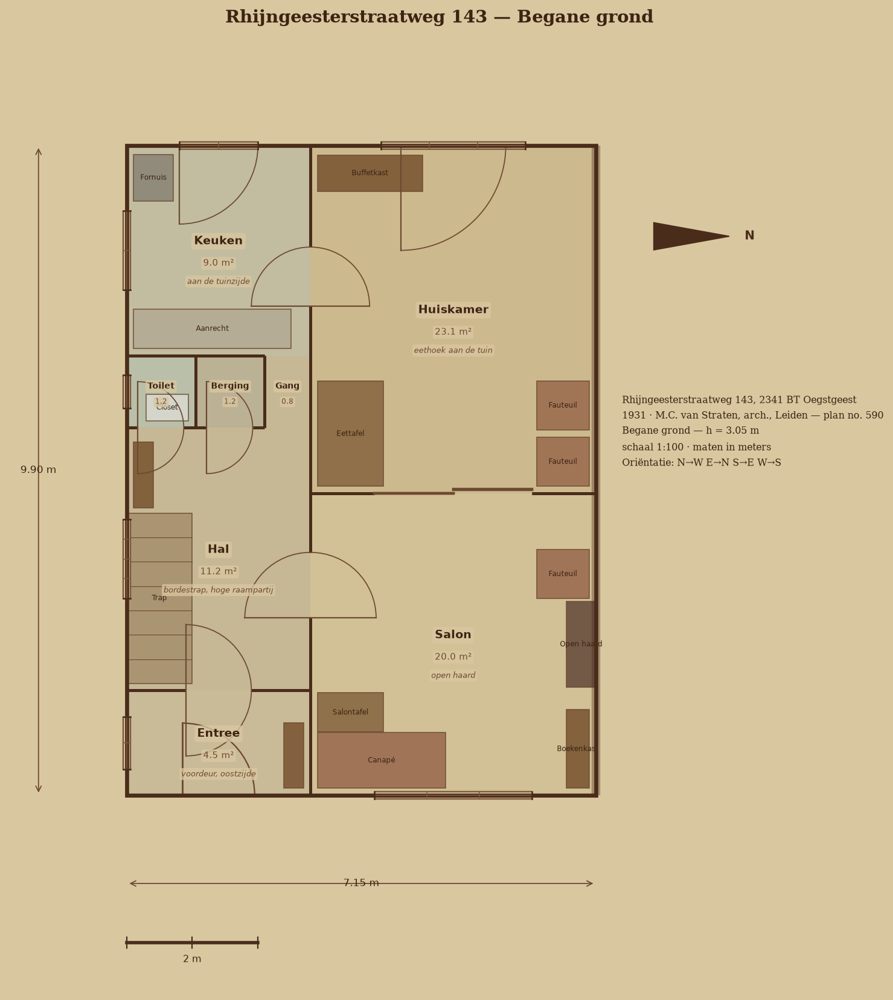
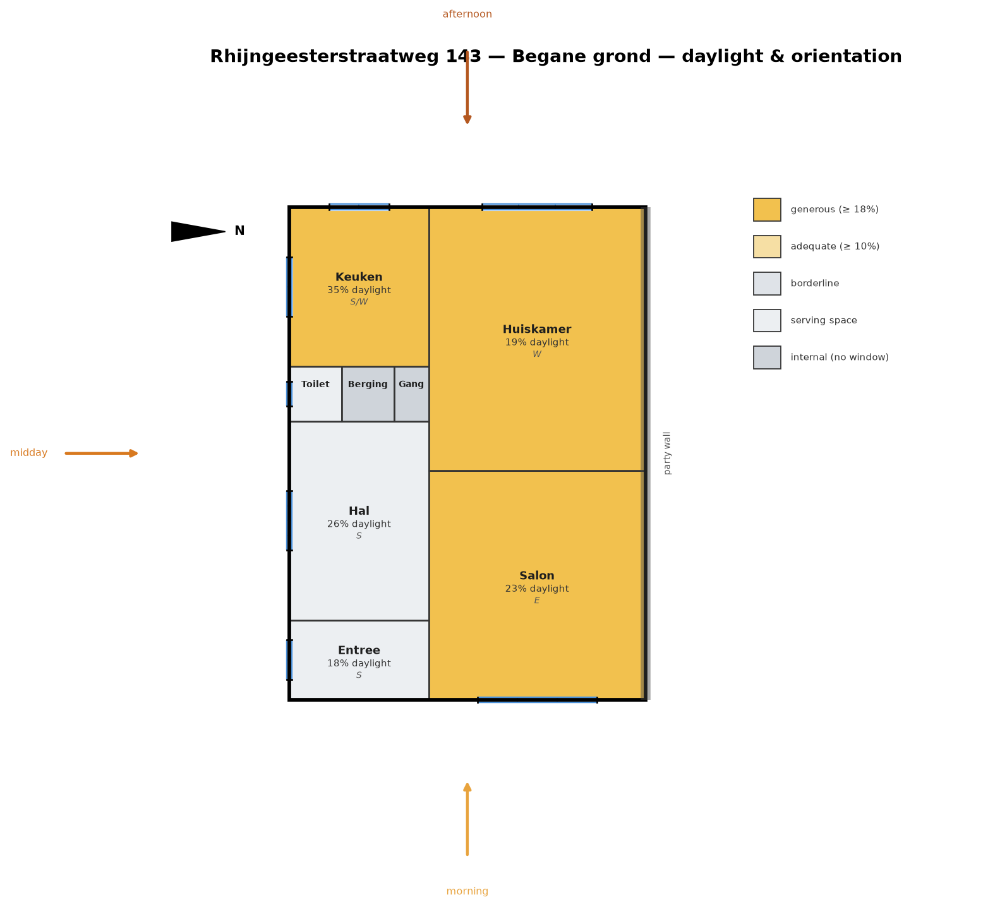
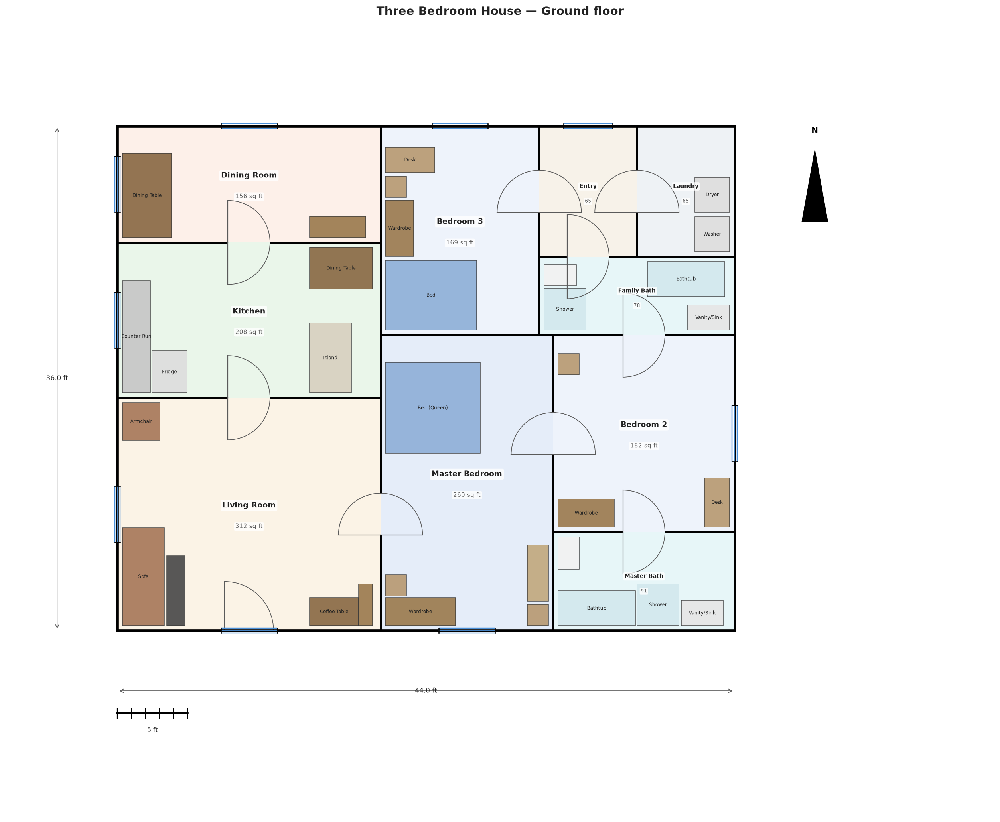

# Capstone — Architectural Interior Design Visuals & Layout Generator

A Python toolkit that turns a JSON building description into a complete
architectural drawing package: room layout, furniture, labelled 2D floor
plans with doors, windows and dimensions, a daylight-and-orientation
analysis, and a pseudo-3D view.

It works in two modes:

- **Generated** — give it a footprint and a list of rooms with relative
  size weights, and it invents a plan (space partitioning, circulation,
  windows, furniture).
- **Surveyed** — give it the real room rectangles, windows and fixtures of
  an existing building, and it draws that building faithfully. This is
  used to reproduce **Rhijngeesterstraatweg 143 in Oegstgeest**, a 1931
  Dutch *herenhuis*, from its original construction drawings.

| 1931 ground floor | Daylight & orientation | Generated plan |
|---|---|---|
|  |  |  |

## The 1931 house

`examples/rhijngeesterstraatweg_143.json` is a surveyed model of one
house from a block of six *landhuizen* built in 1931 to plan no. 590 by
the Leiden architect M.C. van Straten, approved by the municipality of
Oegstgeest on 1 July 1931. It is reconstructed from the original
construction drawings together with the current sale particulars, and
`tools/build_rhijngeesterstraatweg_143.py` regenerates the JSON with the
tiling checks that keep the geometry honest.

What the sources gave, and how the model uses it:

- **Size.** The drawings set the block at 27.00 m across three units:
  7.15 m for each end unit and 6.70 m for the middle one, over a 9.00 m
  body. A note on the approved sheet records that the house was built
  **0.90 m deeper** than drawn, so the model uses a 7.15 × 9.90 m
  footprint. Three of those floor plates come to about 212 m² gross,
  which nets down to the 198 m² of living space the brochure advertises.
- **Layout.** The period arrangement is kept: a narrow service band
  (entree, hal with the *bordestrap*, toilet, berging, keuken at the
  garden end) beside a band of principal rooms (salon and huiskamer
  *en-suite* through sliding doors, with the fireplace on the party
  wall). Above it are four bedrooms and a bathroom, and three more
  bedrooms under the hipped roof — the seven bedrooms and two bathrooms
  the particulars list.
- **Orientation.** No. 143 is the corner unit, so its free flank carries
  a side garden. The plan is drawn garden-up, which puts the rear garden
  **west**, the front door **east** to the Rhijngeesterstraatweg, the
  free side **south** (the "zonnige hoekligging" of the listing), and the
  party wall **north**. That north flank is declared blind, and a test
  asserts no window is ever placed on it.
- **Lights.** The 1931 elevations show tall openings with a divided upper
  light (*bovenlicht*) over one large pane. Windows therefore carry a
  real width, height, sill and pane count, and the renderer draws one
  mullion tick per light. The tall *bordestrap* window that lights the
  stair is modelled as its own opening type.

One conflict in the sources is worth naming: the brochure's prose says the
back garden faces west, while its structured data field says south. The
corner geometry reconciles them — the rear garden faces west and the side
garden south — and the model follows the prose. Orientation is a single
spec field (`north_angle_deg`), so this is one number to change.

## What it does

1. **Layout** (`layout.py`) — for generated plans, a recursive
   guillotine partition tiles the footprint into non-overlapping rooms
   sized by weight, always cutting across the longer side so rooms stay
   close to square. Adjacency is computed from shared walls and a
   minimum-spanning tree decides the interior doors, capping private
   rooms at one door where the room graph allows and relaxing that cap
   only where it is the only way to keep the plan connected. Surveyed
   plans skip all of this and keep their own geometry.
2. **Furniture** (`furniture_catalog.py`, `heritage.py`,
   `furniture_placer.py`) — a per-room-type catalogue is placed along the
   walls in priority order, respecting door swings and windows and never
   overlapping. Fixed building fabric (staircases, the fireplace) is
   pinned by the survey instead, and the placer works around it. There
   are two catalogues: a contemporary one and a 1931 Dutch one where a
   bedroom gets a *ledikant* and a *linnenkast*. Both are stored in
   metres and scaled to the building's unit.
3. **Daylight and orientation** (`daylight.py`) — each room's glazed area
   is compared with its floor area against the Dutch 10% rule of thumb,
   and each window's wall is converted to a real compass bearing to work
   out which part of the day it sees sun. Rooms are rated from
   *generous* down to *internal*.
4. **Drawing** (`renderer.py`, `renderer3d.py`) — floor plans per storey
   in one of two styles, a daylight plan shaded by rating with sun
   arrows, and a pseudo-3D massing view.

Two drawing styles are available. `modern` is a white sheet with black
line work; `heritage` reproduces the idiom of the original sheets — aged
linen paper, sepia ink, muted tinted rooms and a period title block
carrying the address, architect, storey height, scale and orientation.

## Quick start

```bash
python3 -m venv .venv && source .venv/bin/activate
pip install -r requirements.txt

# every example spec into output/
python main.py

# the 1931 house: three storeys, heritage style, with the daylight report
python -m architectural_design.cli generate \
    --spec examples/rhijngeesterstraatweg_143.json --out output/ --daylight

# the same house drawn in the contemporary style instead
python -m architectural_design.cli generate \
    --spec examples/rhijngeesterstraatweg_143.json --out output/ --style modern

# daylight & orientation table only
python -m architectural_design.cli daylight --spec examples/rhijngeesterstraatweg_143.json
```

Per spec you get a floor plan (PNG + SVG) and a daylight plan for every
storey, a 3D view, and a `_summary.json` with room geometry, areas,
glazing, per-room daylight ratios and orientation, plus anything the
furniture placer could not fit.

The daylight report for the 1931 house reads like this:

```
  Room                  Storey              Floor   Glazed   Ratio  Facing    Rating
  Keuken                Begane grond         9.0      3.1    34.8%  S/W       generous
  Salon                 Begane grond        20.0      4.7    23.4%  E         generous
  Huiskamer             Begane grond        23.1      4.3    18.6%  W         generous
  Slaapkamer 5          Tweede etage        20.0      1.7     8.4%  E         borderline
```

The attic rooms come out borderline, which is an honest reading: a large
room under a hipped roof lit by a single dormer.

## Writing a spec

**Generated** — rooms with relative area weights:

```json
{
  "name": "Studio Apartment", "width": 28, "height": 22, "units": "ft",
  "rooms": [
    {"name": "Living Area", "type": "living_room", "weight": 3.2},
    {"name": "Bathroom", "type": "bathroom", "weight": 0.7, "needs_window": false}
  ]
}
```

`weight` is a relative share of floor area, not an absolute size.

**Surveyed** — explicit geometry, optionally over several storeys:

```json
{
  "name": "...", "units": "m", "width": 7.15, "height": 9.90,
  "north_angle_deg": 270, "style": "heritage", "blind_sides": ["E"],
  "storeys": [{
    "name": "Begane grond", "level": 0, "ceiling_height": 3.05,
    "rooms": [{
      "name": "Hal", "type": "hal", "x": 0, "y": 1.6, "width": 2.8, "height": 4.0,
      "windows":   [{"side": "W", "position": 2.0, "role": "stair"}],
      "doors":     [{"side": "S", "position": 1.4, "width": 1.1, "kind": "front_door"}],
      "furniture": [{"name": "Trap", "x": 0, "y": 0.1, "width": 1.0,
                     "height": 2.6, "kind": "stair"}]
    }]
  }]
}
```

- `north_angle_deg` is the compass bearing of the plan's +Y axis, so 0 is
  a north-up drawing and 270 means the top of the sheet faces west.
- `blind_sides` marks party walls, which get no openings.
- Room `type` accepts Dutch names from the drawings — `keuken`,
  `huiskamer`, `salon`, `hal`, `slaapkamer`, `badkamer`, `zolder`,
  `overloop`, `berging` and more — as well as the English ones.
- A window may name a period `role` (`living_front`, `bedroom`, `stair`,
  `dormer`, `kitchen`, `toilet`, `small`) instead of spelling out its
  size and pane count.
- Door `kind` covers `front_door`, `garden`, `sliding` (the *en-suite*
  schuifdeuren) and `opening` (a cased opening with no leaf).
- A room's `furniture` list pins fixtures by offset from its corner.

## Project layout

```
architectural_design/
  models.py             geometry, rooms, storeys, openings, compass helpers
  layout.py             partitioning engine, circulation, spec -> Building
  daylight.py           daylight ratios and sun orientation per room
  heritage.py           the 1931 Dutch profile: style, palette, windows, furniture
  furniture_catalog.py  contemporary catalogue (metric, unit-scaled)
  furniture_placer.py   perimeter placement heuristic
  renderer.py           2D floor plans + the daylight plan
  renderer3d.py         pseudo-3D massing view
  spec.py               JSON loading for both generated and surveyed specs
  cli.py                command-line entry point
examples/               specs, plus committed sample renders
tools/                  regenerates the surveyed 1931 spec, with tiling checks
tests/                  pytest suite (51 tests)
```

## Tests

```bash
source .venv/bin/activate && python -m pytest tests/ -v
```

They cover the geometry primitives, the layout engine (no overlaps, areas
proportional to weight and tiling the footprint exactly, every room
reachable), the furniture placer (nothing overlapping or outside its
room), the daylight and compass maths, unit conversion, and the 1931
house itself — its footprint, its seven bedrooms and two bathrooms, its
orientation, its blind party wall and its pinned staircase.

## Known limitations

- The generated layout is a guillotine partition, so every room is a
  plain rectangle and there is no hallway spine. On some room graphs a
  private room ends up carrying an extra door as the only route to an
  ensuite cluster; connectivity is always preferred over the one-door
  rule.
- Furniture placement is a greedy perimeter heuristic, not a solver, so a
  small or heavily-doored room can have an item skipped. Skipped items
  are reported in the summary rather than forced to overlap.
- The daylight figure is a glazing-to-floor-area ratio with a compass
  reading, not a climate-based simulation: it takes no account of
  overshadowing, room depth or glazing transmittance.
- The 3D view is a simple extruded massing model, not a photorealistic
  render.
- The surveyed 1931 model reconstructs room positions from the original
  drawings at 1:100 plus the recorded as-built depth. Partition positions
  are faithful to the drawn arrangement but are not a measured survey of
  the house as it stands today.
